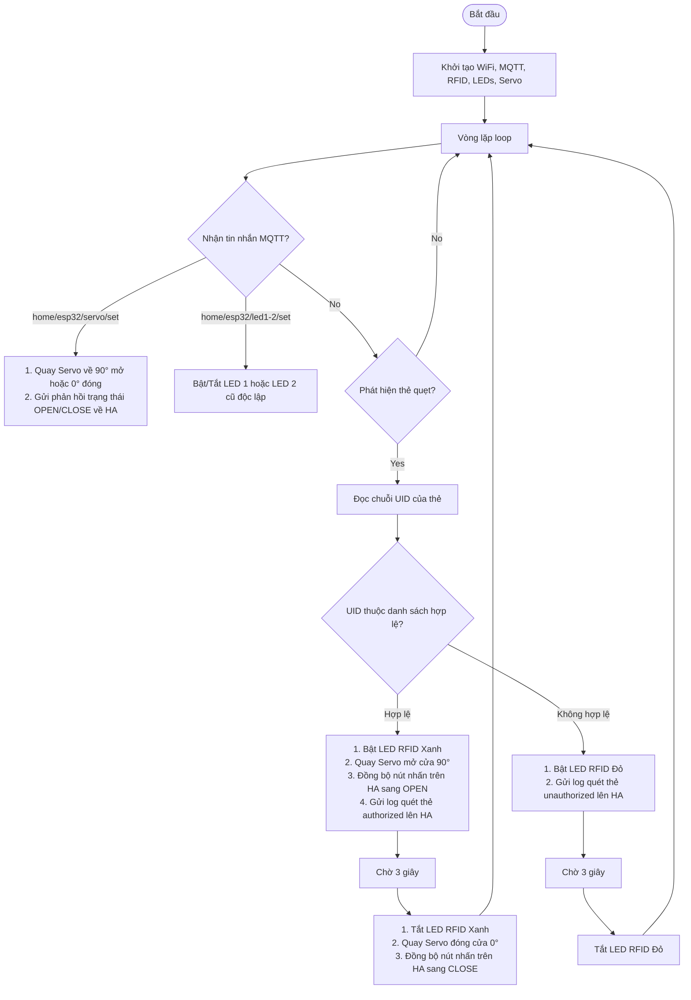

# Hướng dẫn chi tiết chức năng khóa cửa RFID & Servo trên ESP32

Tài liệu này hướng dẫn chi tiết cách hoạt động, đấu nối phần cứng và cách sử dụng hệ thống kiểm soát cửa ra vào bằng thẻ RFID kết hợp động cơ Servo và điều khiển thông qua Home Assistant.

---

## 1. Luồng hoạt động của hệ thống (Workflow)

Hệ thống hoạt động song song 2 cơ chế điều khiển: quẹt thẻ RFID trực tiếp tại thiết bị và bấm nút đóng/mở trên Home Assistant.



---

## 2. Hướng dẫn đấu nối chân phần cứng (Wiring Diagram)

Dưới đây là sơ đồ đấu nối chân chi tiết giữa ESP32 và các thiết bị ngoại vi:

### A. Bộ đọc thẻ RFID MFRC522 (Giao tiếp SPI)
| Chân MFRC522 | Chân ESP32 | Chức năng | Ghi chú |
| :--- | :--- | :--- | :--- |
| **SDA (SS)** | **GPIO 5** | SPI Chip Select | Có thể thay đổi chân trong code |
| **SCK** | **GPIO 18** | SPI Clock | Chân SPI mặc định của ESP32 |
| **MOSI** | **GPIO 23** | SPI MOSI | Chân SPI mặc định của ESP32 |
| **MISO** | **GPIO 19** | SPI MISO | Chân SPI mặc định của ESP32 |
| **RST** | **GPIO 22** | Reset Pin | Chân Reset đầu đọc |
| **GND** | **GND** | Ground | Đất chung |
| **3.3V** | **3.3V** | Nguồn cấp 3.3V | **Tuyệt đối không cấp nguồn 5V** |

### B. Bộ đèn LED báo hiệu RFID & Động cơ Servo
| Thiết bị | Chân ESP32 | Chức năng | Ghi chú |
| :--- | :--- | :--- | :--- |
| **LED RFID Xanh** | **GPIO 25** | Báo thẻ hợp lệ | Nối nối tiếp với điện trở 220 Ohm |
| **LED RFID Đỏ** | **GPIO 26** | Báo thẻ không hợp lệ | Nối nối tiếp với điện trở 220 Ohm |
| **Servo (Signal)** | **GPIO 13** | Tín hiệu PWM điều khiển Servo | Dùng thư viện ESP32Servo |
| **Servo VCC** | **5V (Vin)** | Nguồn cấp cho Servo SG90 | Nếu dùng Servo lớn nên cấp nguồn 5V ngoài |
| **Servo GND** | **GND** | Nguồn đất chung | |

### C. Hai LED cũ (Vẫn giữ nguyên chức năng cũ độc lập)
| Thiết bị | Chân ESP32 | Chức năng | Ghi chú |
| :--- | :--- | :--- | :--- |
| **LED 1** | **GPIO 2** | Bật/tắt qua MQTT từ HA | Không liên quan đến RFID |
| **LED 2** | **GPIO 4** | Bật/tắt qua MQTT từ HA | Không liên quan đến RFID |

---

## 3. Hướng dẫn sử dụng chi tiết

### Bước 1: Quét tìm UID thẻ của bạn
Khi quẹt bất kỳ thẻ nào lên đầu đọc RFID, ESP32 sẽ tự động in mã thẻ (UID) ra cổng Serial và gửi tin nhắn lên MQTT.
*   **Cách xem qua Serial Monitor**: Kết nối ESP32 với máy tính qua cáp USB, mở Serial Monitor ở tốc độ Baud là `115200`. Khi quẹt thẻ, màn hình sẽ hiển thị dạng:
    `RFID Card Scanned. UID: AB CD EF 12`
*   **Cách xem qua MQTT**: Subscribe chủ đề `home/esp32/rfid/log`. Khi quẹt thẻ sẽ có gói tin JSON gửi lên dạng:
    `{"uid": "AB CD EF 12", "status": "unauthorized"}`

### Bước 2: Đăng ký thẻ hợp lệ vào hệ thống
Mở tệp tin `src/config.cpp` trên máy tính của bạn và dán mã thẻ vừa tìm được vào mảng `AUTHORIZED_UIDS` (viết chữ HOA và cách nhau bằng dấu cách):

```cpp
const char *AUTHORIZED_UIDS[] = {
    "12 34 56 78",
    "AB CD EF 12" // Thẻ mới của bạn ở đây
};
```
Tiến hành nạp lại chương trình (Upload firmware) xuống ESP32.

### Bước 3: Đóng/Mở cửa tại chỗ bằng thẻ
*   **Quẹt thẻ Hợp lệ**: LED RFID Xanh sáng lên, Servo quay 90° để mở chốt cửa. Sau 3 giây, Servo tự động quay về 0° (đóng chốt) và tắt LED Xanh.
*   **Quẹt thẻ Không hợp lệ**: LED RFID Đỏ nháy sáng trong 3 giây để cảnh báo, Servo không quay (cửa vẫn khóa).

### Bước 4: Đóng/Mở cửa từ xa qua Home Assistant
Trên giao diện Lovelace của Home Assistant sẽ xuất hiện một công tắc có tên `"Cua Ra Vao (Servo)"`.
*   **Mở cửa từ xa**: Bật công tắc này sang trạng thái "Bật (ON)". Servo sẽ ngay lập tức quay 90° để mở cửa.
*   **Đóng cửa**: Tắt công tắc về "Tắt (OFF)". Servo sẽ quay về 0° để khóa cửa.
*   *Lưu ý*: Khi bạn quẹt thẻ hợp lệ tại chỗ, công tắc trên Home Assistant sẽ tự động chuyển sang trạng thái "Bật" trong 3 giây và tự động chuyển về "Tắt" đồng bộ theo chốt cửa thực tế.
