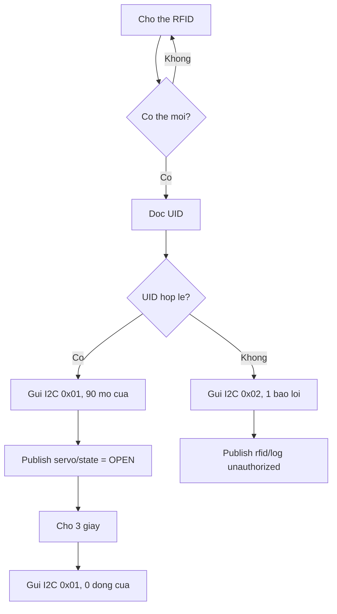
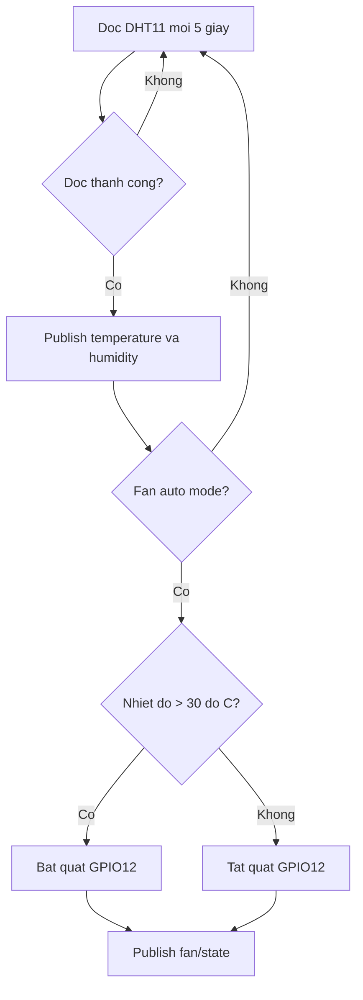
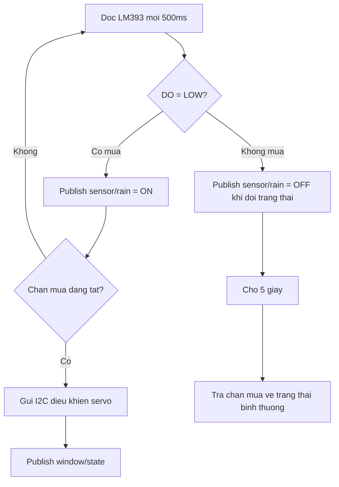

# BAO CAO DO AN

## DE TAI: THIET KE VA MO PHONG HE THONG NHA THONG MINH SU DUNG ESP32, ARDUINO UNO, MQTT VA HOME ASSISTANT

**Sinh vien thuc hien:** ................................................  
**MSSV:** ...............................................................  
**Lop:** ................................................................  
**Giang vien huong dan:** ................................................  
**Don vi:** .............................................................  
**Nam hoc:** 2025 - 2026

---

## LOI CAM ON

Trong qua trinh thuc hien do an, em da co co hoi tim hieu va van dung cac kien thuc ve he thong nhung, lap trinh vi dieu khien, giao tiep I2C, truyen thong MQTT va nen tang Home Assistant. Em xin gui loi cam on den giang vien huong dan da dinh huong, gop y va ho tro em trong qua trinh xay dung mo hinh. Em cung xin cam on cac ban trong lop da ho tro trao doi y tuong, thu nghiem thiet bi va kiem tra cac tinh nang cua he thong.

Do thoi gian va dieu kien thuc nghiem con han che, bao cao kho tranh khoi thieu sot. Em rat mong nhan duoc y kien dong gop cua thay co de de tai duoc hoan thien hon.

---

## TOM TAT DO AN

Do an trinh bay qua trinh thiet ke va mo phong mot he thong nha thong minh su dung ESP32 lam bo dieu khien trung tam, Arduino Uno lam bo mo rong ngo ra, MQTT lam giao thuc truyen thong va Home Assistant lam giao dien giam sat - dieu khien. He thong cho phep nguoi dung dieu khien den, cua, cua so, quat lam mat; dong thoi tu dong phan ung voi cac tinh huong moi truong nhu nhiet do cao, co mua, co nguoi trong nha ve sinh, rung chan dong dat va ro ri khi gas.

Mo hinh duoc xay dung theo kien truc IoT cuc bo. ESP32 ket noi WiFi, trao doi du lieu voi MQTT Broker Mosquitto, dong bo trang thai voi Home Assistant va gui lenh I2C den Arduino Uno. Arduino Uno tiep nhan cac goi lenh I2C de dieu khien servo cua chinh, servo cua so va cac den LED mo phong khu vuc trong nha. Mot so ngo ra co yeu cau phan ung nhanh hoac dieu khien truc tiep duoc dat tren ESP32, nhu LED trang thai, quat lam mat qua chan GPIO12 va coi bao dong dung chung cho canh bao gas - dong dat.

Ket qua dat duoc la mot he thong mo phong co day du cac chuc nang co ban cua nha thong minh: dieu khien tu xa qua Home Assistant, dong bo trang thai bang MQTT, tu dong hoa theo cam bien, canh bao an toan va hien thi thong tin tren LCD. De tai co tinh ung dung trong hoc tap, mo phong he thong IoT dan dung va co the mo rong thanh mo hinh nha thong minh quy mo lon hon.

**Tu khoa:** ESP32, Arduino Uno, IoT, MQTT, Home Assistant, Mosquitto, I2C, RFID, DHT11, nha thong minh.

---

# MUC LUC

1. Gioi thieu de tai  
2. Co so ly thuyet  
3. Phan tich yeu cau he thong  
4. Thiet ke tong the  
5. Thiet ke phan cung  
6. Thiet ke phan mem va giao thuc  
7. Thiet ke cac chuc nang chinh  
8. Mo phong, cai dat va van hanh  
9. Kiem thu va danh gia ket qua  
10. Ket luan va huong phat trien  
11. Tai lieu tham khao  
12. Phu luc

---

# CHUONG 1. GIOI THIEU DE TAI

## 1.1. Ly do chon de tai

Trong nhung nam gan day, Internet of Things (IoT) phat trien manh me va duoc ung dung rong rai trong cac linh vuc nhu nha thong minh, nong nghiep thong minh, cong nghiep, y te va quan ly nang luong. Doi voi nha thong minh, cac thiet bi dien trong gia dinh khong chi duoc dieu khien bang cong tac truyen thong ma con co the duoc dieu khien tu xa, tu dong hoa theo dieu kien moi truong va theo doi trang thai theo thoi gian thuc.

ESP32 la mot vi dieu khien phu hop cho cac ung dung IoT vi co WiFi/Bluetooth tich hop, gia thanh thap, nhieu chan GPIO va co the lap trinh bang Arduino Framework. Tuy nhien, khi so luong thiet bi ngoai vi tang len, viec su dung them Arduino Uno lam bo mo rong ngo ra giup he thong linh hoat hon, dong thoi cho thay cach ket hop nhieu vi dieu khien trong mot mo hinh thuc te.

Tu nhung ly do tren, de tai "Thiet ke va mo phong he thong nha thong minh su dung ESP32, Arduino Uno, MQTT va Home Assistant" duoc lua chon nham xay dung mot mo hinh co tinh ung dung, de quan sat, de mo rong va phu hop voi muc tieu hoc tap mon He thong nhung/IoT.

## 1.2. Muc tieu de tai

De tai huong den cac muc tieu sau:

- Xay dung mo hinh nha thong minh co kha nang dieu khien va giam sat qua giao dien Home Assistant.
- Ung dung ESP32 lam bo dieu khien trung tam, ket noi WiFi va truyen nhan du lieu bang MQTT.
- Ung dung Arduino Uno lam thiet bi slave nhan lenh I2C de dieu khien servo va LED mo phong.
- Tich hop cac cam bien: RFID MFRC522, DHT11, cam bien mua LM393, HC-SR04, cam bien rung va cam bien gas.
- Xay dung cac kich ban tu dong hoa: mo cua bang RFID, tu dong dong/mo chan mua, tu dong bat quat khi nhiet do cao, bat den nha ve sinh khi co nguoi, canh bao gas va dong dat.
- Tao nen tang de mo rong them cac chuc nang nhu app di dong, database, dashboard nang cao hoac dieu khien bang giong noi.

## 1.3. Pham vi thuc hien

Do an tap trung vao mo phong va xay dung prototype quy mo nho. He thong su dung LED va servo de dai dien cho cac thiet bi thuc te trong nha, vi du:

- Servo cua chinh dai dien cho khoa cua thong minh.
- Servo cua so/chan mua dai dien cho co cau dong mo cua so hoac mai che.
- LED dai dien cho cac den phong.
- Quat hoac module L298N dai dien cho quat lam mat.
- Coi buzzer dai dien cho he thong canh bao khan cap.

He thong chua tap trung vao cac yeu to thuong mai nhu vo hop, mach PCB, bao mat nguoi dung nang cao, cap nguon cong suat lon hay ung dung cloud public.

## 1.4. Phuong phap thuc hien

Qua trinh thuc hien duoc chia thanh cac buoc:

1. Khao sat yeu cau va xac dinh cac chuc nang nha thong minh can mo phong.
2. Lua chon linh kien phu hop voi tung chuc nang.
3. Thiet ke so do khoi, so do ket noi chan va giao thuc truyen thong.
4. Lap trinh ESP32 va Arduino Uno tren PlatformIO voi Arduino Framework.
5. Cai dat Mosquitto va Home Assistant bang Docker Compose.
6. Kiem thu tung module rieng le, sau do kiem thu tich hop toan he thong.
7. Danh gia ket qua, ghi nhan han che va de xuat huong phat trien.

---

# CHUONG 2. CO SO LY THUYET

## 2.1. Tong quan ve IoT

IoT la mo hinh ket noi cac thiet bi vat ly voi mang Internet hoac mang cuc bo de thu thap du lieu, truyen du lieu va thuc hien cac hanh dong dieu khien. Mot he thong IoT co ban thuong gom:

- Thiet bi cam bien de thu thap du lieu.
- Bo xu ly trung tam hoac vi dieu khien.
- Giao thuc truyen thong.
- May chu, broker hoac nen tang quan ly.
- Giao dien nguoi dung.

Trong do an nay, ESP32 dong vai tro node IoT trung tam, Mosquitto dong vai tro MQTT Broker va Home Assistant dong vai tro nen tang giam sat - dieu khien.

## 2.2. ESP32

ESP32 la dong vi dieu khien manh, tich hop WiFi va Bluetooth. Cac dac diem phu hop voi de tai:

- Ho tro WiFi de ket noi mang cuc bo.
- Nhieu chan GPIO de ket noi cam bien va thiet bi ngoai vi.
- Ho tro cac giao tiep SPI, I2C, UART, PWM.
- Co the lap trinh bang Arduino Framework tren PlatformIO.
- Phu hop voi MQTT, HTTP va cac giao thuc IoT thong dung.

Trong he thong, ESP32 dam nhan cac nhiem vu:

- Ket noi WiFi.
- Ket noi MQTT Broker.
- Doc cac cam bien gan truc tiep.
- Gui du lieu cam bien len Home Assistant.
- Nhan lenh tu Home Assistant.
- Dieu khien mot so ngo ra truc tiep.
- Gui lenh I2C den Arduino Uno.

## 2.3. Arduino Uno

Arduino Uno su dung vi dieu khien ATmega328P, phu hop cho viec dieu khien cac thiet bi don gian nhu LED, buzzer va servo. Trong do an, Arduino Uno duoc su dung lam I2C slave de mo rong so luong ngo ra va tach mot phan tai dieu khien khoi ESP32.

Arduino Uno nhan goi tin I2C gom 2 byte tu ESP32:

- Byte thu nhat: ma lenh.
- Byte thu hai: du lieu dieu khien.

Sau khi nhan lenh, Arduino thuc hien dieu khien servo, LED phong khach, den bep, den phong ngu, den nha ve sinh va cac den bao RFID.

## 2.4. Giao thuc I2C

I2C la giao thuc noi tiep dong bo gom hai duong truyen:

- SDA: duong du lieu.
- SCL: duong xung clock.

He thong su dung ESP32 lam master va Arduino Uno lam slave tai dia chi `0x08`. Do ESP32 hoat dong muc logic 3.3V trong khi Arduino Uno hoat dong 5V, de ket noi truc tiep an toan, hai duong SDA/SCL duoc keo len 3.3V bang dien tro 4.7k ohm hoac 10k ohm va tat ke board phai noi chung GND.

## 2.5. MQTT va Mosquitto

MQTT la giao thuc publish/subscribe nhe, phu hop voi IoT. Cac thanh phan chinh:

- Publisher: thiet bi gui du lieu len topic.
- Subscriber: thiet bi dang ky nhan du lieu tu topic.
- Broker: trung gian phan phoi tin nhan.
- Topic: kenh du lieu co cau truc dang chuoi.

Trong do an, Mosquitto la MQTT Broker chay tren Docker, lang nghe cong `1883`. ESP32 publish du lieu cam bien va trang thai thiet bi len broker, Home Assistant subscribe cac topic nay de hien thi. Khi nguoi dung thao tac tren Home Assistant, Home Assistant publish lenh dieu khien vao topic, ESP32 subscribe va xu ly.

## 2.6. Home Assistant

Home Assistant la nen tang nha thong minh ma nguon mo, cho phep tich hop nhieu thiet bi, tao dashboard va automation. Trong de tai, Home Assistant duoc cau hinh bang file `configuration.yaml` de tao cac thuc the MQTT:

- Switch dieu khien den, cua, quat, cua so.
- Binary sensor hien thi trang thai mua, gas, dong dat.
- Sensor hien thi nhiet do va do am.

## 2.7. Cac cam bien va thiet bi su dung

He thong su dung cac thiet bi:

- MFRC522: doc the RFID de mo cua.
- DHT11: do nhiet do va do am.
- LM393 rain sensor: phat hien mua.
- HC-SR04: do khoang cach, mo phong phat hien nguoi trong nha ve sinh.
- SW-420 hoac module rung tuong duong: canh bao rung/dong dat.
- MQ-2/MQ-5 hoac module gas tuong duong: canh bao ro ri khi gas.
- LCD I2C 16x2: hien thi ngay gio, nhiet do, do am.
- Servo SG90: mo phong cua chinh va cua so/chan mua.
- LED: mo phong den phong va den bao.
- Buzzer: canh bao sai the, gas va dong dat.

---

# CHUONG 3. PHAN TICH YEU CAU HE THONG

## 3.1. Yeu cau chuc nang

He thong can dap ung cac chuc nang sau:

### 3.1.1. Dieu khien den

Nguoi dung co the dieu khien cac den qua Home Assistant:

- LED 1 tren ESP32.
- Den phong khach.
- Den bep.
- Den phong ngu.
- Den nha ve sinh.
- Nhom "Tat Ca Den" de dieu khien nhieu den cung luc.

### 3.1.2. Khoa cua RFID

He thong cho phep mo cua bang the RFID hop le. Khi the hop le duoc quet:

- ESP32 kiem tra UID trong danh sach cho phep.
- Neu hop le, ESP32 gui lenh I2C mo servo cua chinh.
- LED xanh bao dung sang.
- Trang thai cua duoc publish len Home Assistant.
- Sau 3 giay, cua tu dong dong lai.

Khi the khong hop le:

- He thong tu choi truy cap.
- ESP32 gui lenh I2C kich hoat LED do va coi bao loi.
- Log RFID duoc publish len topic MQTT.

### 3.1.3. Do nhiet do - do am va dieu khien quat

DHT11 duoc doc moi 5 giay. Gia tri nhiet do va do am duoc gui len MQTT. Quat co hai che do:

- Manual: nguoi dung bat/tat quat tren Home Assistant.
- Auto: neu nhiet do lon hon 30.0 do C, quat tu bat; neu nhiet do nho hon hoac bang 30.0 do C, quat tu tat.

Trong phien ban code hien tai, quat duoc dieu khien truc tiep bang chan GPIO12 cua ESP32. Khi lap mo phong bang LED hoac module L298N, LED/module quat se noi voi GPIO12 va dung chung GND voi he thong.

### 3.1.4. Tu dong che/dong cua so khi mua

Cam bien mua LM393 duoc doc moi 500 ms. Khi co mua, dau ra DO cua cam bien o muc LOW. He thong thuc hien:

- Publish trang thai mua len MQTT.
- Tu dong kich hoat co cau che mua/cua so.
- Gui lenh I2C den Arduino Uno de dieu khien servo cua so.
- Dong bo trang thai len Home Assistant.

Khi het mua, he thong doi 5 giay truoc khi dua co cau ve trang thai binh thuong. Co che tre nay giup tranh dao dong lien tuc khi cam bien vua kho hoac con nuoc.

### 3.1.5. Tu dong den nha ve sinh bang HC-SR04

Cam bien sieu am HC-SR04 do khoang cach moi 500 ms. Neu phat hien doi tuong o khoang cach nho hon 10 cm, he thong xem nhu co nguoi trong nha ve sinh va bat den. Khi khong con phat hien nguoi, he thong doi 5 giay roi tat den. Trang thai den nha ve sinh duoc dong bo len Home Assistant.

### 3.1.6. Canh bao dong dat

Cam bien rung ket noi GPIO32. Khi co rung, ESP32:

- Chuyen trang thai canh bao dong dat sang ON.
- Publish trang thai len MQTT.
- Kich hoat coi bao dong thong qua ham cap nhat coi chung.

Sau khi ngung rung 5 giay, trang thai canh bao duoc xoa.

### 3.1.7. Canh bao ro ri gas

Cam bien gas ket noi GPIO4. Khi module phat hien gas va tin hieu DO ve LOW, ESP32:

- Chuyen trang thai canh bao gas sang ON.
- Publish trang thai len MQTT.
- Kich hoat coi bao dong chung.

Khi gas khong con duoc phat hien, trang thai tro ve OFF.

### 3.1.8. Hien thi LCD

LCD I2C 16x2 hien thi:

- Dong 1: ngay gio lay tu NTP theo mui gio Viet Nam UTC+7.
- Dong 2: nhiet do va do am doc tu DHT11.

LCD cap nhat moi 1 giay, giup nguoi dung quan sat nhanh thong tin tai mo hinh.

## 3.2. Yeu cau phi chuc nang

- He thong phai phan hoi tuong doi nhanh voi lenh dieu khien tu Home Assistant.
- Trang thai thiet bi phai duoc publish lai de dong bo giao dien.
- Cac module phai duoc tach rieng de de bao tri va mo rong.
- Giao tiep I2C phai on dinh, duong day ngan va co dien tro keo len phu hop.
- He thong chay duoc trong mang LAN, khong phu thuoc cloud.
- Ma nguon phai co cau truc ro rang, phu hop voi PlatformIO.

---

# CHUONG 4. THIET KE TONG THE

## 4.1. So do khoi he thong

```mermaid
flowchart LR
    HA[Home Assistant] <--> MQTT[Mosquitto MQTT Broker]
    MQTT <--> ESP[ESP32 Master]
    ESP <--> I2C[I2C Bus SDA/SCL]
    I2C <--> UNO[Arduino Uno Slave]

    RFID[RFID MFRC522] --> ESP
    DHT[DHT11] --> ESP
    RAIN[Cam bien mua LM393] --> ESP
    GAS[Cam bien gas] --> ESP
    QUAKE[Cam bien rung] --> ESP
    RADAR[HC-SR04] --> ESP
    LCD[LCD I2C] <--> ESP
    FAN[Quat/L298N GPIO12] <-- ESP
    BUZZER[Coi bao dong GPIO33] <-- ESP

    UNO --> DOOR[Servo cua chinh]
    UNO --> WINDOW[Servo cua so/chan mua]
    UNO --> LEDS[Den phong va LED bao RFID]
```

## 4.2. Kien truc dieu khien

He thong duoc chia thanh ba lop:

### Lop thiet bi hien truong

Bao gom cam bien va co cau chap hanh: DHT11, RFID, cam bien mua, gas, rung, HC-SR04, LCD, servo, LED, buzzer va quat.

### Lop dieu khien nhung

ESP32 la bo dieu khien trung tam, xu ly logic chinh, ket noi WiFi, MQTT va I2C. Arduino Uno la bo dieu khien phu, nhan lenh I2C de dieu khien cac ngo ra duoc mo rong.

### Lop giam sat - dieu khien

Mosquitto va Home Assistant chay trong Docker. Mosquitto dong vai tro broker, Home Assistant dong vai tro dashboard va trung tam quan ly thiet bi.

## 4.3. Luong du lieu tong quat

1. Cam bien doc du lieu va gui ve ESP32.
2. ESP32 xu ly logic va publish trang thai len MQTT.
3. Home Assistant nhan du lieu tu MQTT va hien thi thanh entity.
4. Nguoi dung thao tac tren Home Assistant.
5. Home Assistant publish lenh dieu khien vao topic MQTT.
6. ESP32 subscribe topic, xu ly lenh.
7. Neu thiet bi nam tren Arduino Uno, ESP32 gui goi I2C den Arduino.
8. Arduino thuc hien lenh va ESP32 publish lai trang thai de dong bo.

## 4.4. Cau truc thu muc ma nguon

```text
Iot/
├── platformio.ini
├── docker-compose.yml
├── mosquitto/config/mosquitto.conf
├── homeassistant/config/configuration.yaml
├── src/
│   ├── esp32/
│   │   ├── main.cpp
│   │   ├── include/
│   │   └── modules/
│   └── arduino/
│       ├── main.cpp
│       ├── include/
│       └── modules/
└── .doc/
    ├── wiring_connections.md
    ├── rfid_guide.md
    ├── sensor_fan_guide.md
    └── rain_window_guide.md
```

---

# CHUONG 5. THIET KE PHAN CUNG

## 5.1. Danh sach linh kien

| STT | Linh kien | So luong | Chuc nang |
|---:|---|---:|---|
| 1 | ESP32 DevKit | 1 | Dieu khien trung tam, WiFi, MQTT, doc cam bien |
| 2 | Arduino Uno | 1 | Slave I2C, mo rong ngo ra |
| 3 | MFRC522 RFID | 1 | Doc the mo cua |
| 4 | DHT11 | 1 | Do nhiet do, do am |
| 5 | Cam bien mua LM393 | 1 | Phat hien mua |
| 6 | HC-SR04 | 1 | Phat hien nguoi bang khoang cach |
| 7 | Cam bien rung | 1 | Canh bao dong dat/rung |
| 8 | Cam bien gas MQ-2/MQ-5 | 1 | Canh bao ro ri gas |
| 9 | LCD I2C 16x2 | 1 | Hien thi gio, nhiet do, do am |
| 10 | Servo SG90 | 2 | Mo phong cua chinh va cua so |
| 11 | LED | Nhieu | Mo phong den va den bao |
| 12 | Buzzer | 1-2 | Canh bao |
| 13 | Dien tro 220 ohm | Nhieu | Han dong cho LED |
| 14 | Dien tro 4.7k/10k ohm | 2 | Keo len SDA/SCL I2C ve 3.3V |
| 15 | Module L298N/relay/transistor | 1 | Dieu khien quat DC neu dung quat that |
| 16 | Breadboard, day cam | Nhieu | Lap mach mo phong |

## 5.2. Ket noi I2C giua ESP32 va Arduino Uno

| Duong tin hieu | ESP32 | Arduino Uno | Ghi chu |
|---|---|---|---|
| SDA | GPIO21 | A4 | Keo len 3.3V qua dien tro 4.7k/10k |
| SCL | GPIO22 | A5 | Keo len 3.3V qua dien tro 4.7k/10k |
| GND | GND | GND | Bat buoc noi chung dat |

Luu y: Do ESP32 dung logic 3.3V, hai dien tro pull-up cua I2C nen duoc keo ve chan 3.3V cua ESP32 thay vi 5V cua Arduino. Day I2C nen ngan hon 20 cm de giam nhieu va tranh loi timeout.

## 5.3. Thiet bi ket noi voi ESP32

| Thiet bi | Chan thiet bi | Chan ESP32 | Chuc nang |
|---|---|---|---|
| RFID MFRC522 | SDA/SS | GPIO5 | Chon chip SPI |
| RFID MFRC522 | SCK | GPIO18 | Clock SPI |
| RFID MFRC522 | MOSI | GPIO23 | Du lieu SPI master out |
| RFID MFRC522 | MISO | GPIO19 | Du lieu SPI master in |
| RFID MFRC522 | RST | GPIO14 | Reset RFID |
| DHT11 | DATA | GPIO15 | Doc nhiet do/do am |
| LM393 Rain | DO | GPIO27 | LOW khi co mua |
| LED 1 | Anode qua 220 ohm | GPIO2 | LED trang thai |
| LCD I2C | SDA | GPIO21 | Dung chung bus I2C |
| LCD I2C | SCL | GPIO22 | Dung chung bus I2C |
| HC-SR04 | TRIG | GPIO25 | Phat xung sieu am |
| HC-SR04 | ECHO | GPIO26 | Nhan xung phan hoi |
| Cam bien rung | DO | GPIO32 | HIGH khi rung |
| Cam bien gas | DO | GPIO4 | LOW khi phat hien gas |
| Buzzer canh bao | VCC/tin hieu | GPIO33 | Coi gas/dong dat |
| Quat/L298N | IN1 | GPIO12 | Dieu khien quat |

## 5.4. Thiet bi ket noi voi Arduino Uno

| Thiet bi | Chan Arduino | Chuc nang |
|---|---|---|
| Servo cua chinh | D12 | Mo/dong cua chinh |
| Servo cua so/chan mua | D11 | Dieu khien cua so/chan mua |
| LED phong khach | D7 | Den phong khach |
| LED RFID xanh | D8 | Bao the hop le |
| LED RFID do | D9 | Bao the khong hop le |
| Den bep / buzzer loi RFID trong code hien tai | D6 | Den bep hoac coi bao loi tuy cach dau |
| Den phong ngu | D5 | Den phong ngu |
| Den nha ve sinh | D4 | Den nha ve sinh |

## 5.5. Luu y ve nguon dien

- ESP32 va Arduino Uno phai noi chung GND.
- RFID MFRC522 nen cap 3.3V, khong cap 5V.
- LCD I2C thuong can 5V de sang ro, nhung duong I2C phai duoc keo len 3.3V khi dung chung voi ESP32.
- Servo nen dung nguon 5V on dinh, neu servo bi sut ap co the lam reset board.
- Module gas MQ can thoi gian lam nong va thuong dung nguon 5V.
- Neu dieu khien quat DC, khong noi quat truc tiep vao GPIO. Can dung L298N, relay hoac transistor va diode bao ve neu can.

---

# CHUONG 6. THIET KE PHAN MEM VA GIAO THUC

## 6.1. Moi truong phat trien

Do an su dung PlatformIO voi hai moi truong build:

| Moi truong | Board | Framework | Thu muc nguon |
|---|---|---|---|
| `esp32` | `esp32dev` | Arduino | `src/esp32/` |
| `uno` | `uno` | Arduino | `src/arduino/` |

Thu vien chinh:

- PubSubClient: ket noi MQTT.
- MFRC522: doc RFID.
- DHT sensor library: doc DHT11.
- LiquidCrystal_I2C: dieu khien LCD.
- ESP32Servo/Servo: dieu khien servo.
- Wire: giao tiep I2C.

## 6.2. Chuong trinh ESP32

File `src/esp32/main.cpp` khoi tao cac module theo thu tu:

1. Serial Monitor.
2. LED.
3. I2C Master.
4. RFID va servo logic.
5. DHT11 va quat.
6. Cam bien mua.
7. Radar HC-SR04.
8. Cam bien dong dat.
9. Cam bien gas.
10. WiFi.
11. LCD va NTP.
12. MQTT.

Vong lap chinh goi lan luot:

- `mqttLoop()`
- `rfidServoLoop()`
- `dhtLoop()`
- `rainLoop()`
- `lcdLoop()`
- `radarLoop()`
- `earthquakeLoop()`
- `gasLoop()`
- `updateBuzzer()`

Cach thiet ke theo module giup moi chuc nang co vong lap rieng, tranh viec toan bo logic nam trong mot file lon.

## 6.3. Chuong trinh Arduino Uno

Arduino Uno chi can khoi tao I2C slave va lap lai ham xu ly:

- `initI2CSlave()`: cau hinh chan output, attach servo, khoi tao I2C dia chi `0x08`.
- `i2cSlaveLoop()`: kiem tra lenh moi tu ESP32, xu ly switch-case theo ma lenh.

Lenh I2C duoc nhan trong callback `receiveEvent()`, sau do duoc xu ly ngoai ngat de tranh thuc hien tac vu lau trong ISR.

## 6.4. Cau hinh WiFi va MQTT

Thong tin WiFi va MQTT nam trong `src/esp32/modules/config.cpp`:

```cpp
const char *WIFI_SSID = "IOT";
const char *WIFI_PASSWORD = "12345667";
const char *MQTT_SERVER = "10.179.116.3";
const int MQTT_PORT = 1883;
```

Khi trien khai thuc te, can thay doi dia chi `MQTT_SERVER` theo IP may chay Mosquitto/Home Assistant trong mang LAN.

## 6.5. Giao thuc I2C

Arduino Uno co dia chi I2C la `0x08`. Moi goi lenh gom 2 byte:

```text
[Command_ID, Data]
```

| Command ID | Ten lenh | Data | Tac dung |
|---:|---|---|---|
| `0x01` | Servo cua chinh | `90` | Mo cua, bat LED xanh |
| `0x01` | Servo cua chinh | `0` | Dong cua, tat LED xanh |
| `0x02` | Canh bao RFID sai | `1` | Bat LED do va coi/den bao loi |
| `0x03` | Den phong khach | `1/0` | Bat/tat den phong khach |
| `0x05` | Servo cua so/chan mua | `0/90` | Dieu khien servo cua so |
| `0x06` | Den bep | `1/0` | Bat/tat den bep |
| `0x07` | Den phong ngu | `1/0` | Bat/tat den phong ngu |
| `0x08` | Den nha ve sinh | `1/0` | Bat/tat den nha ve sinh |

## 6.6. He thong topic MQTT

### 6.6.1. Topic nhan lenh tu Home Assistant

| Topic | Payload | Chuc nang |
|---|---|---|
| `home/esp32/led1/set` | `ON/OFF` | Dieu khien LED 1 ESP32 |
| `home/esp32/led_phong_khach/set` | `ON/OFF` | Dieu khien den phong khach |
| `home/esp32/led_bep/set` | `ON/OFF` | Dieu khien den bep |
| `home/esp32/led_phong_ngu/set` | `ON/OFF` | Dieu khien den phong ngu |
| `home/esp32/led_nha_ve_sinh/set` | `ON/OFF` | Dieu khien den nha ve sinh |
| `home/esp32/servo/set` | `OPEN/CLOSE` | Dieu khien cua chinh |
| `home/esp32/fan/mode/set` | `auto/manual` | Chon che do quat |
| `home/esp32/fan/set` | `ON/OFF` | Dieu khien quat thu cong |
| `home/esp32/window/set` | `OPEN/CLOSE` | Dieu khien cua so/chan mua |

### 6.6.2. Topic publish trang thai va du lieu

| Topic | Payload | Y nghia |
|---|---|---|
| `home/esp32/servo/state` | `OPEN/CLOSE` | Trang thai cua chinh |
| `home/esp32/rfid/log` | JSON | Log quet the RFID |
| `home/esp32/sensor/temperature` | So thuc | Nhiet do do C |
| `home/esp32/sensor/humidity` | So thuc | Do am phan tram |
| `home/esp32/fan/state` | `ON/OFF` | Trang thai quat |
| `home/esp32/fan/mode/state` | `auto/manual` | Che do quat |
| `home/esp32/sensor/rain` | `ON/OFF` | Co mua/khong mua |
| `home/esp32/window/state` | `OPEN/CLOSE` | Trang thai cua so/chan mua |
| `home/esp32/led_nha_ve_sinh/state` | `ON/OFF` | Trang thai den nha ve sinh |
| `home/esp32/sensor/earthquake` | `ON/OFF` | Canh bao dong dat |
| `home/esp32/sensor/gas` | `ON/OFF` | Canh bao gas |

## 6.7. Docker Compose

He thong server cuc bo gom hai container:

- `mosquitto`: MQTT Broker, cong `1883`.
- `homeassistant`: dashboard, cong `8123`, mui gio `Asia/Ho_Chi_Minh`.

Mosquitto duoc cau hinh cho phep anonymous trong moi truong mo phong:

```conf
listener 1883 0.0.0.0
allow_anonymous true
persistence true
persistence_location /mosquitto/data/
log_dest stdout
```

Trong trien khai thuc te, nen bat tai khoan/mat khau va gioi han truy cap broker.

---

# CHUONG 7. THIET KE CAC CHUC NANG CHINH

## 7.1. Chuc nang khoa cua RFID

### Nguyen ly

ESP32 doc UID the RFID qua giao tiep SPI voi module MFRC522. UID duoc chuyen thanh chuoi HEX in hoa, sau do so sanh voi mang `AUTHORIZED_UIDS`.

Danh sach UID hop le duoc khai bao trong `config.cpp`, vi du:

```cpp
const char *AUTHORIZED_UIDS[] = {
    "12 34 56 78",
    "AB CD EF 12",
    "70 A6 AC 55",
    "E0 58 58 9B"
};
```

### Luu do xu ly



### Danh gia

Chuc nang nay mo phong duoc mo hinh khoa cua thong minh co xac thuc. Cua tu dong dong sau 3 giay giup tranh truong hop nguoi dung quen dong cua.

## 7.2. Chuc nang dieu khien den

Den duoc dieu khien qua cac switch MQTT tren Home Assistant. Khi nhan topic, ESP32 xu ly:

- LED 1: dieu khien truc tiep GPIO2.
- Den phong khach/bep/phong ngu/nha ve sinh: gui lenh I2C den Arduino Uno.

Rieng den nha ve sinh co them logic tu dong tu HC-SR04, nhung van co topic dieu khien thu cong tren Home Assistant.

## 7.3. Chuc nang quat theo nhiet do

### Nguyen ly

DHT11 duoc doc moi 5 giay. Neu che do auto dang bat:

- `T > 30.0°C`: bat quat.
- `T <= 30.0°C`: tat quat.

Neu nguoi dung bam switch quat thu cong, he thong tu chuyen sang manual mode de uu tien lenh nguoi dung.

### Luu do



### Danh gia

Chuc nang nay the hien duoc tu dong hoa theo nguong moi truong. Nguong 30 do C phu hop voi mo phong, co the cau hinh lai neu trien khai thuc te.

## 7.4. Chuc nang cam bien mua va cua so/chan mua

### Nguyen ly

Cam bien mua LM393 co dau ra so:

- LOW: co mua/co nuoc.
- HIGH: kho.

Khi phat hien mua, ESP32 tu dong bat che do chan mua va gui lenh I2C den Arduino dieu khien servo cua so. Khi het mua, he thong doi 5 giay truoc khi dua servo ve trang thai binh thuong.

### Co che an toan

Khi dang mua, he thong khong cho tat che do chan mua. Neu nguoi dung gui lenh trai logic, ESP32 se publish lai trang thai dung len Home Assistant.

### Luu do



## 7.5. Chuc nang den nha ve sinh tu dong

HC-SR04 phat xung sieu am va do thoi gian phan hoi. Khoang cach duoc tinh:

```text
distance = (duration / 2) * 0.0343
```

Neu `distance < 10 cm`, he thong xem nhu co nguoi va bat den nha ve sinh. Khi khong phat hien nguoi trong 5 giay, den duoc tat.

Chuc nang nay giup tiet kiem dien va tang tinh tien nghi cua mo hinh nha thong minh.

## 7.6. Chuc nang canh bao gas va dong dat

He thong dung chung coi bao dong GPIO33. Ham `updateBuzzer()` trong `main.cpp` thuc hien:

```cpp
bool shouldBuzz = isQuakingState() || isGasLeakingState();
digitalWrite(BUZZER_PIN, shouldBuzz ? HIGH : LOW);
```

Nhu vay, chi can mot trong hai trang thai nguy hiem xay ra, coi se duoc kich hoat. Day la cach thiet ke don gian nhung hieu qua cho mo hinh canh bao tong hop.

## 7.7. Chuc nang LCD va NTP

Sau khi ESP32 ket noi WiFi, LCD duoc khoi tao va ESP32 dong bo thoi gian qua NTP server `pool.ntp.org`. Man hinh hien thi:

- Dong 1: `DD/MM/YY HH:MM`
- Dong 2: `T:xx.xC H:yy.y%`

LCD cap nhat moi 1 giay, giup mo hinh co kha nang hien thi doc lap ngay ca khi nguoi dung khong mo Home Assistant.

---

# CHUONG 8. MO PHONG, CAI DAT VA VAN HANH

## 8.1. Cai dat server cuc bo

Tu thu muc du an, chay:

```bash
docker compose up -d
```

Sau khi container khoi dong:

- Mosquitto MQTT Broker chay tai cong `1883`.
- Home Assistant chay tai `http://localhost:8123`.

Khi su dung ESP32 that, can dam bao ESP32 va may chay Docker nam cung mang LAN. Dia chi IP MQTT trong `config.cpp` phai la IP cua may chay Mosquitto.

## 8.2. Bien dich va nap chuong trinh

### Nap ESP32

```bash
pio run -e esp32
pio run -e esp32 -t upload
pio device monitor -e esp32
```

### Nap Arduino Uno

```bash
pio run -e uno
pio run -e uno -t upload
pio device monitor -e uno
```

Neu co nhieu cong serial, co the cau hinh upload port trong PlatformIO hoac de PlatformIO tu dong do tim.

## 8.3. Cau hinh Home Assistant

File `homeassistant/config/configuration.yaml` khai bao cac entity MQTT. Sau khi cap nhat file cau hinh, can restart Home Assistant de nhan entity moi.

Cac nhom entity chinh:

- Switch: den, cua, quat, che do quat, cua so.
- Sensor: nhiet do, do am.
- Binary sensor: mua, gas, dong dat.

## 8.4. Kich ban van hanh mo phong

### Kich ban 1: Dieu khien den

1. Mo Home Assistant.
2. Bat switch LED 1.
3. Quan sat LED tren ESP32 sang.
4. Bat den phong khach, den bep, den phong ngu.
5. Quan sat LED tuong ung tren Arduino Uno thay doi trang thai.

### Kich ban 2: Mo cua bang RFID

1. Quet the RFID hop le.
2. Quan sat servo cua chinh quay 90 do.
3. LED xanh sang.
4. Trang thai cua tren Home Assistant chuyen sang `OPEN`.
5. Sau 3 giay, servo quay ve 0 do va trang thai chuyen sang `CLOSE`.
6. Quet the khong hop le, LED do/canh bao loi duoc kich hoat.

### Kich ban 3: Quat tu dong

1. Bat che do quat tu dong tren Home Assistant.
2. Lam tang nhiet do quanh DHT11.
3. Khi nhiet do lon hon 30 do C, quat bat.
4. Khi nhiet do giam ve nho hon hoac bang 30 do C, quat tat.

### Kich ban 4: Mua va cua so/chan mua

1. Tao trang thai kho cho cam bien mua.
2. Nho nuoc len tam cam bien.
3. Quan sat Home Assistant hien thi trang thai mua.
4. Servo cua so/chan mua duoc dieu khien tu dong.
5. Lau kho cam bien, doi 5 giay.
6. He thong tu dua co cau ve trang thai binh thuong.

### Kich ban 5: Den nha ve sinh tu dong

1. Dua vat the vao khoang cach nho hon 10 cm truoc HC-SR04.
2. Den nha ve sinh tu bat.
3. Dua vat the ra xa.
4. Sau 5 giay den tu tat.

### Kich ban 6: Canh bao an toan

1. Tao rung tren cam bien rung.
2. Quan sat binary sensor dong dat tren Home Assistant chuyen ON.
3. Coi bao dong kich hoat.
4. Kich hoat cam bien gas.
5. Quan sat binary sensor gas chuyen ON va coi tiep tuc bao dong.

---

# CHUONG 9. KIEM THU VA DANH GIA KET QUA

## 9.1. Bang kiem thu chuc nang

| STT | Chuc nang | Cach kiem thu | Ket qua mong doi | Danh gia |
|---:|---|---|---|---|
| 1 | Ket noi WiFi | Khoi dong ESP32 | Serial in IP cuc bo | Dat |
| 2 | Ket noi MQTT | Chay Mosquitto va ESP32 | ESP32 subscribe topic thanh cong | Dat |
| 3 | Dieu khien LED 1 | Bat/tat switch HA | LED GPIO2 doi trang thai | Dat |
| 4 | Dieu khien den phong | Bat/tat switch HA | Arduino nhan I2C va LED doi trang thai | Dat |
| 5 | Mo cua RFID hop le | Quet UID trong danh sach | Servo mo, LED xanh sang, MQTT OPEN | Dat |
| 6 | Tu choi RFID sai | Quet UID la | LED do/canh bao loi, log unauthorized | Dat |
| 7 | DHT11 | Doc moi 5 giay | Nhiet do/do am hien tren HA va LCD | Dat |
| 8 | Quat auto | Nhiet do > 30 do C | Quat bat, state ON | Dat |
| 9 | Cam bien mua | Nho nuoc vao LM393 | Rain ON, servo kich hoat | Dat |
| 10 | Het mua | Lau kho cam bien | Sau 5 giay co cau ve binh thuong | Dat |
| 11 | Den nha ve sinh | Vat the < 10 cm | Den bat, sau 5 giay khong co nguoi thi tat | Dat |
| 12 | Canh bao rung | Tao rung | MQTT earthquake ON, coi keu | Dat |
| 13 | Canh bao gas | Kich hoat cam bien gas | MQTT gas ON, coi keu | Dat |
| 14 | LCD | Ket noi WiFi va doc DHT | LCD hien gio, nhiet do, do am | Dat |

## 9.2. Danh gia ve tinh on dinh

He thong duoc thiet ke theo vong lap khong chan cho cac module chinh bang cach su dung `millis()` thay vi su dung nhieu `delay()`. Dieu nay giup ESP32 van xu ly MQTT, doc cam bien va cap nhat trang thai lien tuc. Mot so tac vu nhu phat xung HC-SR04 co su dung `pulseIn()` voi timeout 30 ms, muc nay chap nhan duoc trong mo hinh.

Giao tiep I2C la phan can luu y nhat. Neu day SDA/SCL qua dai hoac keo len sai muc dien ap, he thong co the bi timeout hoac nhan lenh khong on dinh. Cach khac phuc la dung day ngan, noi GND chung, dung dien tro pull-up ve 3.3V va co the giam toc do I2C khi can.

## 9.3. Danh gia ve kha nang mo rong

He thong co kha nang mo rong tot vi:

- Moi chuc nang duoc tach thanh module rieng trong `src/esp32/modules`.
- MQTT topic duoc dat theo cau truc ro rang.
- Arduino Uno nhan lenh theo command ID, de them lenh moi.
- Home Assistant co the them entity moi qua cau hinh YAML.
- Docker Compose giup trien khai broker va dashboard don gian.

## 9.4. Han che cua de tai

- Chua co co che xac thuc MQTT, do Mosquitto dang cho phep anonymous de tien mo phong.
- Danh sach UID RFID duoc cau hinh co dinh trong code, chua co giao dien them/xoa the.
- Cam bien DHT11 co do chinh xac va toc do phan hoi han che.
- Cam bien gas can hieu chuan nguong thuc te neu su dung trong moi truong that.
- He thong moi la prototype breadboard, chua co PCB va hop bao ve.
- Chua luu lich su du lieu vao database rieng de phan tich dai han.
- Chua co ung dung mobile rieng, dang su dung giao dien Home Assistant.

---

# CHUONG 10. KET LUAN VA HUONG PHAT TRIEN

## 10.1. Ket luan

Do an da thiet ke va mo phong thanh cong he thong nha thong minh su dung ESP32, Arduino Uno, MQTT va Home Assistant. He thong dap ung duoc cac chuc nang quan trong nhu dieu khien den, mo cua bang RFID, do nhiet do/do am, dieu khien quat tu dong, tu dong xu ly khi mua, bat den nha ve sinh theo phat hien nguoi va canh bao an toan khi co gas hoac rung.

Qua qua trinh thuc hien, de tai giup lam ro cach ket hop nhieu thanh phan trong mot he thong IoT hoan chinh: tu cam bien, vi dieu khien, giao tiep noi bo I2C, giao thuc MQTT den dashboard Home Assistant. Mo hinh cung the hien duoc tu duy thiet ke he thong nhung theo module, de bao tri va mo rong.

## 10.2. Huong phat trien

Trong tuong lai, he thong co the duoc phat trien theo cac huong:

- Bo sung bao mat MQTT bang username/password hoac TLS.
- Them giao dien quan ly RFID de them/xoa the tu Home Assistant.
- Luu du lieu nhiet do, do am, gas, mua vao database nhu InfluxDB.
- Tao dashboard bieu do theo thoi gian thuc bang Grafana.
- Tich hop dieu khien bang giong noi.
- Thiet ke PCB va hop bao ve cho mo hinh.
- Nang cap cam bien DHT11 len DHT22/SHT31 de tang do chinh xac.
- Them automation phuc tap hon trong Home Assistant.
- Gui canh bao qua Telegram, email hoac push notification khi phat hien gas/dong dat.
- Dung nguon rieng on dinh cho servo va quat de tang do ben.

---

# TAI LIEU THAM KHAO

1. Espressif Systems, ESP32 Technical Reference Manual.
2. Arduino Documentation, Arduino Uno Rev3.
3. MQTT Version 3.1.1 Specification.
4. Home Assistant Documentation - MQTT Integration.
5. Eclipse Mosquitto Documentation.
6. PlatformIO Documentation.
7. Datasheet cam bien DHT11.
8. Datasheet module RFID MFRC522.
9. Tai lieu noi bo trong thu muc `.doc/` cua do an.

---

# PHU LUC A. TOM TAT CAU HINH HOME ASSISTANT

Cac entity MQTT chinh:

- `switch.led_1`
- `switch.led_phong_khach`
- `switch.cua_ra_vao_servo`
- `switch.quat_lam_mat`
- `switch.che_do_quat_tu_dong`
- `switch.cua_so_servo`
- `switch.den_bep`
- `switch.den_phong_ngu`
- `switch.den_nha_ve_sinh`
- `binary_sensor.cam_bien_mua`
- `binary_sensor.canh_bao_dong_dat`
- `binary_sensor.canh_bao_khi_gas`
- `sensor.nhiet_do`
- `sensor.do_am`

---

# PHU LUC B. TOM TAT CAC THAM SO QUAN TRONG

| Tham so | Gia tri |
|---|---|
| Baudrate ESP32 | 115200 |
| Baudrate Arduino Uno | 9600 |
| MQTT Port | 1883 |
| Home Assistant Port | 8123 |
| I2C Slave Address | `0x08` |
| ESP32 SDA | GPIO21 |
| ESP32 SCL | GPIO22 |
| DHT interval | 5000 ms |
| Rain interval | 500 ms |
| Radar interval | 500 ms |
| LCD interval | 1000 ms |
| RFID auto close | 3000 ms |
| Rain dry delay | 5000 ms |
| Bathroom light off delay | 5000 ms |
| Temperature threshold | 30.0 do C |
| Radar detection threshold | < 10 cm |
| Buzzer pin | GPIO33 |

---

# PHU LUC C. LENH VAN HANH NHANH

```bash
# Chay Mosquitto va Home Assistant
docker compose up -d

# Build ESP32
pio run -e esp32

# Upload ESP32
pio run -e esp32 -t upload

# Build Arduino Uno
pio run -e uno

# Upload Arduino Uno
pio run -e uno -t upload
```

---

# PHU LUC D. NHAN XET TONG HOP

He thong nha thong minh trong do an co uu diem la kien truc ro rang, tan dung tot ESP32 cho ket noi IoT va Arduino Uno cho mo rong ngo ra. Viec su dung MQTT va Home Assistant giup qua trinh giam sat - dieu khien truc quan, phu hop voi xu huong nha thong minh hien nay. Cac chuc nang tu dong hoa nhu quat theo nhiet do, chan mua, den nha ve sinh va canh bao gas/dong dat giup mo hinh co tinh thuc te hon so voi viec chi dieu khien bat/tat don gian.

Neu duoc tiep tuc hoan thien ve bao mat, nguon dien, co khi va giao dien quan ly, de tai co the phat trien thanh mot bo mo hinh day hoc IoT hoac mot he thong nha thong minh quy mo nho co kha nang ung dung trong thuc te.
